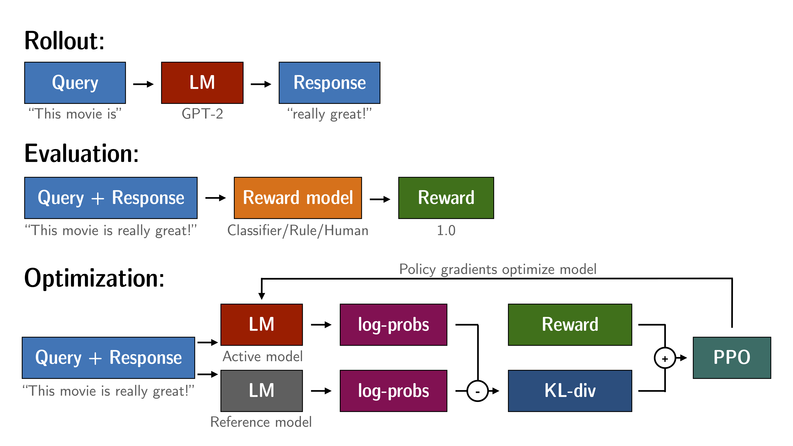

# LLM模型开源资源汇总

## OpenAI GPT相关

- 由于OpenAI逐步走向闭源，openAI GPT3开始不再开源模型和代码，instrucGPT（有论文） 、GPT3.5（任何报告说明，只有API 不可以微调）、Chatgpt（网页访问）、 GPT4（技术报告） 以及后面的GPT5（？），OpenAI不再Open 而是CloseAI了，所以现在都是基于OpenAI API接口做一些应用和测评工作

### 产品应用

| 应用产品 | 类型 | 地址 | 简要说明 |
| --- | --- | --- | --- |
| 智能文本分析 | 文档分析工具 | https://zhuanlan.zhihu.com/p/613928848 |  |
| 翻译工具 | 语言翻译 | https://github.com/yetone/openai-translator。 | 完全基于OpenAI API接口来集成开发，需要key和翻墙 |
| 代码编辑器 | 代码辅助工具 | https://github.com/getcursor/cursor   [GitHub Copilot X](https://github.com/features/preview/copilot-x) | cursor开源后不再支持GPT4，微软的CopilotX全面支持GPT4 |
| axiv论文分析工具 | 文本分析工具 | [chatgpt-arxiv-extension](https://github.com/hunkimForks/chatgpt-arxiv-extension) | 可以在此基础上做一个论文分析小助手，每天查看最新论文并且分析论文主要思想 |

### LLM模型测评

#### GPT系列模型测评

##### **准确性、校准性、鲁棒性、公平性、偏见、毒性和效率测评**

[How Robust is GPT-3.5 to Predecessors? A Comprehensive Study on Language Understanding Tasks](https://arxiv.org/abs/2303.00293) 主要是chatgpt gpt3.5的鲁棒性测试

[On the Robustness of ChatGPT: An Adversarial and Out-of-distribution Perspective](https://arxiv.org/abs/2302.12095)  不同业务场景和数据场景下对chatgpt场外的测评**

[Holistic Evaluation of Language Models](https://arxiv.org/abs/2211.09110)

**针对16个核心场景中每个场景测量7个指标（准确性、校准性、鲁棒性、公平性、偏见、毒性和效率），尽可能地保证超出准确度范围内的其他指标不会被忽略，并清楚地暴露跨模型和跨指标之间的权衡。此外，我们还执行7项有针对性评估，基于26个有针对性场景来更深入地分析特定方面（例如知识、推理、记忆/版权问题以及虚假信息）**

##### **业务能力的测评**

##### **医疗**场景

[Capabilities of GPT-4 on Medical Challenge Problems](https://arxiv.org/abs/2303.13375) GPT4对医疗场景的能力测试，包含医学考试、医疗的应用场景

[Using ChatGPT to evaluate cancer myths andmisconceptions: artificial intelligence and cancerinformation](https://pubmed.ncbi.nlm.nih.gov/36929393/) 对了诊断与癌症咨询， chatgpt vs 权威癌症专家的对比

##### **综合测评**

[GPT-4 Technical Report](https://arxiv.org/abs/2303.08774) OpenAI 发布的技术报告对GPT4进行全方位的解读

[Sparks of Artificial General Intelligence: Early experiments with GPT-4](https://arxiv.org/abs/2303.12712) 认为GPT4目前是AGI早期版本，在某些领域超过了人类，各个业务场景进行测评分析

#### LLM模型测评

huggingface社区，[model-evaluator](https://hf.co/spaces/autoevaluate/model-evaluator)，[blog](https://mp.weixin.qq.com/s/UJeyxAKjcWJg5mmbAr4Dxw)

EleutherAI，[lm-evaluation-harness](https://github.com/EleutherAI/lm-evaluation-harness)，[BIG-bench](https://github.com/google/BIG-bench)

## 开源自研LLM

### 微调技术

- LLM模型的微调主要技术分成两个部分
    - [PEFT](https://www.notion.so/AIGC-461f2d7a844c4c7a86071db3b72e2937):完成更多场景下zero-shot和few-shot，通过大量构造prompt dataset微调模型能够支持更多场景的任务，并且支持场景的zero-shot和few-shot任务，如果需要完成较为复杂的推理内容可以采用Cot技术，可以在promt dataset上面续写推理过程，激活LLM模型推理能力
    - [TRL](https://github.com/lvwerra/trl):控制生成质量，主要通过TRL（transformer Reinforrcement Learning）技术对LLM模型的生成内容进行人为的控制，目前主流是RLHF技术

#### instrcution tuning(指令微调)

[PEFT](https://github.com/huggingface/peft) huggingface最有效的微调方式

* [LoRA](https://github.com/microsoft/LoRA)，[LoRA: Low-Rank Adaptation of Large Language Models](https://arxiv.org/abs/2106.09685) ，[ChatGLM-Tuning](https://github.com/mymusise/ChatGLM-Tuning)，[stanford_alpaca](https://github.com/tatsu-lab/stanford_alpaca)，[alpaca-lora](https://github.com/tloen/alpaca-lora)，[lora](https://github.com/cloneofsimo/lora)
* Prefix Tuning，[Prefix-Tuning: Optimizing Continuous Prompts for Generation](https://aclanthology.org/2021.acl-long.353/) , [P-Tuning v2: Prompt Tuning Can Be Comparable to Fine-tuning Universally Across Scales and Tasks](https://arxiv.org/pdf/2110.07602.pdf)
* P-Tuning，[GPT Understands, Too](https://arxiv.org/pdf/2103.10385.pdf)
* Prompt Tuning，[The Power of Scale for Parameter-Efficient Prompt Tuning](https://arxiv.org/pdf/2104.08691.pdf)

#### RLHF（**Reinforcement Learning from Human Feedback**）

主要流程如下所示

**TRL**，[Deep reinforcement learning from human preferences ](https://arxiv.org/abs/1706.03741) ，[Training language models to follow instructions with human feedback](https://arxiv.org/abs/2203.02155)  [ChatGPT: Optimizing Language Models for Dialogue (OpenAI 2022)](https://openai.casa/blog/chatgpt/)，[trl](https://github.com/lvwerra/trl)，[transformers_tasks](https://github.com/HarderThenHarder/transformers_tasks)  主要实现RLHF过程，后续在这块仔细梳理出来

### 可用的LLM模型(提供底座)

| model | 作者 | size | 类型 | 开源 | 论文链接 | github地址 | 博客 |
| --- | --- | --- | --- | --- | --- | --- | --- |
| LLaMa | MetaAI | 7B-65B | Decoder | open | https://arxiv.org/pdf/2302.13971v1.pdf | https://github.com/facebookresearch/llama |  |
| OPT | Meta AI | 125M-175B | Decoder | open | https://arxiv.org/pdf/2205.01068.pdf | https://github.com/facebookresearch/metaseq |  |
| T5 | Google | 220M-11B | Encoder-Decoder | Open | https://arxiv.org/pdf/1910.10683.pdf | https://github.com/google-research/text-to-text-transfer-transformerhuggingface平台https://huggingface.co/google?sort_models=likes#models |  |
| mT5 | Google | 20B | Encoder-Decoder | Open | https://arxiv.org/pdf/2010.11934.pdf | https://huggingface.co/models?search=mt5 |  |
| UL2和Flan-UL2 | Google | 20B | Encoder-Decoder | Open | https://arxiv.org/pdf/2205.05131.pdf | https://huggingface.co/google/ul2https://huggingface.co/google/flan-ul2 | https://www.yitay.net/blog/flan-ul2-20b |
| PaLM | Google | 540B | Decoder | 提供API | https://arxiv.org/pdf/2204.02311.pdf |  |  |
| LaMDA | Google | 2B-137B | Decoder | No | https://arxiv.org/pdf/2201.08239.pdf |  | https://blog.google/technology/ai/lamda/ |
| FLAN-T5 | Google | 220M-11B | Encoder-Decoder | Open | https://arxiv.org/pdf/2210.11416.pdf | https://huggingface.co/google/flan-t5-large |  |
| FLAN-PaLM | Google | 同PaLM | Decoder | 提供API |  |  |  |
| FLAN | Google | 同LaMDA | Decoder | No | https://arxiv.org/pdf/2109.01652.pdf |  |  |
| BLOOM | BigScience | 176B | Decoder | Open | https://arxiv.org/pdf/2211.05100.pdf | https://huggingface.co/bigscience/bloom |  |
| T0 | BigScience | 3B | Decoder | open | https://arxiv.org/pdf/2110.08207.pdf | https://huggingface.co/bigscience/T0 |  |
| BLOOMZ | BigScience | 同BLOOM | Decoder | Open | https://arxiv.org/pdf/2211.01786.pdf |  |  |
| mT0 | BigScience | 同T0 | Decoder | Open | https://arxiv.org/pdf/2211.01786.pdf |  |  |
| GPT-Neo | EleutherAI | 125M-2.7B | Decoder | Open |  | https://github.com/EleutherAI/gpt-neo |  |
| GPT-NeoX | EleutherAI | 20B | Decoder | Open | https://arxiv.org/pdf/2204.06745.pdf | https://huggingface.co/EleutherAI/gpt-neox-20b |  |
| GPT3 | OpenAI | 175B (davinci) | Decoder | No | https://arxiv.org/abs/2005.14165 | https://github.com/openai/gpt-3 |  |
| GPT4 | OpenAI | unknown | 多模态 | No | https://arxiv.org/abs/2303.08774 |  |  |
| InstructGPT | OpenAI | 1.3B | Decoder | No | https://arxiv.org/abs/2203.02155 | https://github.com/openai/following-instructions-human-feedback/blob/main/model-card.md |  |
| Alpaca | Stanford | 同LLaMa | Decoder | Open | https://crfm.stanford.edu/2023/03/13/alpaca.html | https://github.com/tatsu-lab/stanford_alpacahttps://github.com/tloen/alpaca-lora |  |
| GLM | 清华EKM | 2b-130B | 混合模型 | Open | https://arxiv.org/abs/2210.02414 | • https://github.com/THUDM/https://github.com/THUDM/GLM-130B |  |
| chatGLM | 清华EKM | 6B | 混合模型 | Open | 直接可以在消费级上使用 | https://github.com/THUDM/ChatGLM-6B |  |
| 元语 | Clue-ai | 0.77B-10B之间 |  | Open | ChatYuan-large-v1/v2是一个支持中英双语的功能型对话语言大模型 | https://github.com/clue-ai/ChatYuan | |
| CPM-Ant | OpenBMB社区 | 10B | 混合模型 | Open |  | https://github.com/OpenBMB/CPM-Live | https://www.openbmb.org/community/blogs/blogpage?id=98afef2ce45f4fe9a4bc15a66d7ccb92b |
| 百度文心(ERINE系列) | 百度 | 260B | 多模型、混合模型（知识增强） | close | |  | 很多博客资料 |
| 盘古 | 华为 | 200B左右 | 多模型 | close | |  | [**华为云盘古大模型系列资料合集**](https://bbs.huaweicloud.com/forum/thread-176967-1-1.html) |
| 混元 | 腾讯 | 1T(万亿) | 多模态 | close | |  | [腾讯发布万亿大模型训练方法：最快256卡1天训完万亿NLP大模型](https://www.thepaper.cn/newsDetail_forward_20908780) |
| **通义** | 阿里 | 10T(万亿) | 多模态 | Open | | https://github.com/alibaba/AliceMind                                         https://github.com/OFA-Sys/OFA | 部分参数开源 |
| **悟道2.0** | 智源社区 | 1.75T | 多模态 |  | |  |  |

### 开源数据集

* 底座测评测试集和微调下游任务测试数据集

| 数据集/项目名称 | 组织/作者 | 论文链接 | github地址 | 简介 |
| --- | --- | --- | --- | --- |
| Natural Instruction / Super-Natural Instruction | Allen AI | https://aclanthology.org/2022.acl-long.244.pdfhttps://arxiv.org/pdf/2204.07705.pdf | https://instructions.apps.allenai.org/ | 包含61个NLP任务（Natural Instruction）和1600个NLP任务（Super-Natural Instruction）的指令数据 |
| PromptSource / P3 | BigScience |  | https://github.com/bigscience-workshop/promptsourcehttps://huggingface.co/datasets/bigscience/P3 | 包含270个NLP任务的2000多个prompt模版（PromptSource）和规模在100M-1B之间的P3数据集 |
| xMTF | BigScience | https://arxiv.org/pdf/2211.01786.pdf | https://github.com/bigscience-workshop/xmtf | 包含13个NLP任务、46种语言的多语言prompt数据 |
| HH-RLHF | Anthropic | https://arxiv.org/pdf/2204.05862.pdf | https://arxiv.org/pdf/2204.05862.pdf | 旨在训练Helpful and Harmless（HH）的LLMs的RLHF数据集 |
| Unnatural Instruction | orhonovich | https://arxiv.org/pdf/2212.09689.pdf | https://github.com/orhonovich/unnatural-instructions | 使用GPT3生成64k的instruction prompt数据，经改写后得到240k条instruction数据 |
| Self-Instruct | yizhongw | https://arxiv.org/pdf/2212.10560.pdf | https://github.com/yizhongw/self-instruct | 使用LLMs生成prompt进行instruct-tuning的方法，引入Task pool和Quality filtering等概念 |
| UnifiedSKG | HKU | https://arxiv.org/pdf/2201.05966.pdf | https://unifiedskg.com/ | 在Text-to-Text框架中加入knowledge grounding，将结构化数据序列化并嵌入到prompt中 |
| Flan Collection | Google | https://arxiv.org/pdf/2301.13688.pdf | https://github.com/google-research/FLAN/tree/main/flan/v2 | 将Flan 2021数据与一些开源的instruction数据（P3，super-natural instruction等）进行合并 |
| InstructDial | prakharguptaz | https://arxiv.org/pdf/2205.12673.pdf | https://github.com/prakharguptaz/Instructdial/tree/main/datasets | 在特定的一种任务类型（对话指令）上进行指令微调的尝试 |
| Alpaca | Stanford |  | https://github.com/tatsu-lab/stanford_alpaca | 53k data, very powerful performance (GPT-3.5 level). |
| GLUE数据集 |  |  | https://github.com/CLUEbenchmark/ZeroCLUEhttps://github.com/CLUEbenchmark/FewCLUE |  |
| Chinese Word Prediction with Long Context (Chinese WPLC) |  |  | https://openi.pcl.ac.cn/PCL-Platform.Intelligence/Chinese_WPLChttps://openi.pcl.ac.cn/PCL-Platform.Intelligence/PanGu-Alpha |  |
| **WuDaoCorpora** | 智源社区 | | [BAAIData](https://data.baai.ac.cn/data-set)                 | |

### 数据标注平台

- 目前市面这类平台非常少，该平台对推动LLM模型发展至关重要

#### promt dataset构建

- 主要是续写大量的场景prompt dataset,可以借助AI的工具来无监督构造，但是需要对不同的场景进行构造，这类数据集一般会采用众包的方式进行

#### **ReWard模型评分数据**

- 对LLM模型生成内容，进行人工打分，获取评分数据来训练reward模型，训练这个模型需要多个人群进行采样，需要客观的获取评分数据

## Prompt engineering

### **[ChatGPT Shortcut](https://github.com/rockbenben/ChatGPT-Shortcut)**

### [PromptBase](https://promptbase.com/)

LLM模型的prompt template marketplace 可以出售promt 策略

### [dair-ai](https://github.com/dair-ai)/**[Prompt-Engineering-Guide](https://github.com/dair-ai/Prompt-Engineering-Guide)**

详细的提供了prompt在LLM模型上面的价值，可以详细了解

### [PromptPerfect - Prompt](https://promptperfect.jina.ai/)

- 第一个自动提示词优化器：第一个也是唯一一个可以自动优化任何 AI 模型提示词的优化器。
- SOTA 人工智能模型：针对最新的 AI 模型（例如 ChatGPT、GPT-3、DALL-E、Stable Diffusion 等）优化您的提示。

- 只支持英文的prompt
- 多目标优化：根据您的需要自定义您的提示优化，例如更快的优化、更短的提示词等等。
- 10 秒内出结果：在 10 秒或更短时间内获得优化的提示词。
- 多语言提示词：您的提示词不必再是英文。您可以优化任何语言的提示词。
- API 和数据访问：API 访问我们的 AI 引擎，将您的数据导出为通用格式，允许您将我们的 AI 集成到您自己的应用程序中。
- 

### [bigscience-workshop](https://github.com/bigscience-workshop)/**[promptsource](https://github.com/bigscience-workshop/promptsource)**

对个NLP相关子任务续写prompt

### **[ChatIE](https://github.com/cocacola-lab/ChatIE)**

来之论文 [Zero-Shot Information Extraction via Chatting with ChatGPT](https://arxiv.org/abs/2302.10205)  如何续写prompt来实现 实体关系三元组抽取、命名实体识别和事件抽取  是的构建知识图谱更加容易

## LLM模型内容检测技术

* 目前人类生产的内容与LLM模型生成的内容，怎么区分，是防止LLM模型使用不当，导致一系列法律法规问题，比如版权、知识产权等等，有效的区分人类生产与LLM模型生产的内容进行有小的检测是非常重要的,该研究方向，存在两个观点，1，可以检测；2，不可以检测

### LLM文本检测

#### 可检测

1. [Paraphrasing evades detectors of AI-generated text, but retrieval is an effective defense](https://papers.labml.ai/api/v1/redirect/pdf?paper_key=2cfe8cecc9f211edb95839eec3084ddd) ，[github](https://github.com/martiansideofthemoon/ai-detection-paraphrases)
2. [DetectGPT: Zero-Shot Machine-Generated Text Detection using Probability Curvature](https://arxiv.org/abs/2301.11305)，[github](https://ericmitchell.ai/detectgpt/)
3. [The-Science-of-LLM-generated-Text-Detection](https://github.com/datamllab/The-Science-of-LLM-generated-Text-Detection)，[github](https://github.com/datamllab/awsome-LLM-generated-text-detection/tree/main)

#### 不可检测

1. [DetectGPT: Zero-Shot Machine-Generated Text Detection using Probability Curvature](https://arxiv.org/abs/2301.11305)，[github](https://ericmitchell.ai/detectgpt/)
2. [Can AI-Generated Text be Reliably Detected](https://arxiv.org/abs/2303.11156)
